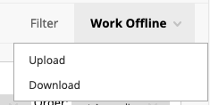
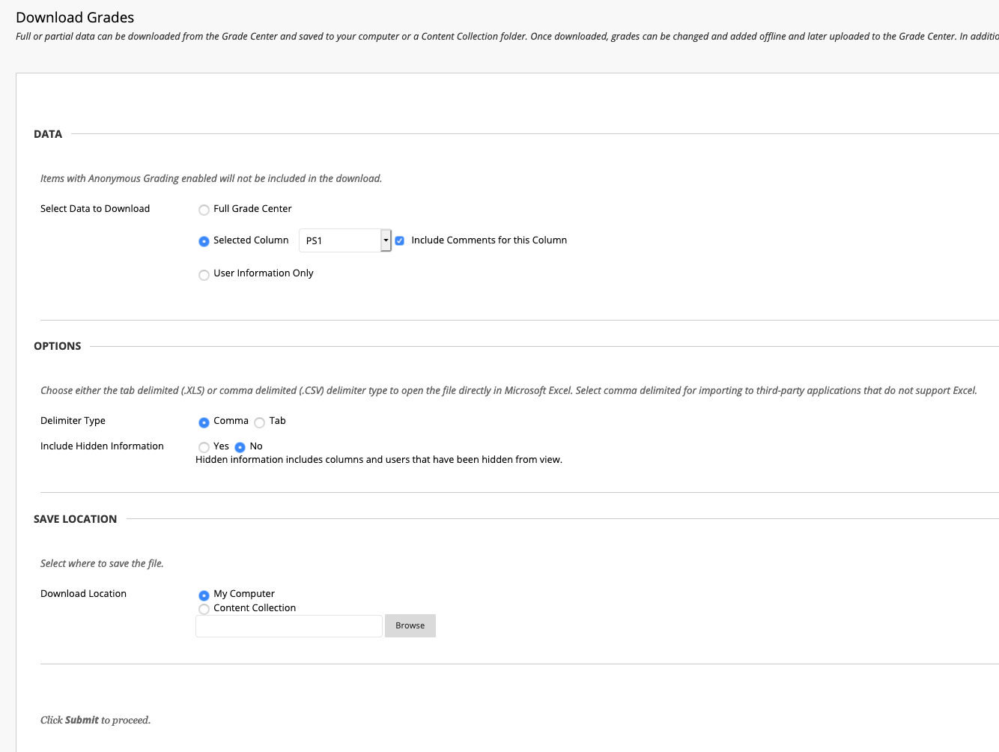

---
output:
  pdf_document: default
---
# Shiny app for grading problem sets

There are a few steps that need to be done before starting the shiny app. I've included an example of the proper structure to use in the PS8 folder.

## Download submission files from blackboard
* On blackboard go to Grade Center -> Full Grade Center. Right click on the problem set and select "Assignment File Download".

* On the "Download Assignment" Page I suggest pressing the show all button at the bottom of the screen, then selecting all of the students and clicking submit. Then save the submissions zip folder which we will refer to as the gradebook zip file because the filename is in the form: "gradebook_20211_buad_312_14924_PS1_2021-01-23-13-39-23.zip".


## Make config.yml and folder structure for the particular problem set
The shiny app assumes that within the `path_to_shiny_dir` folder specified in your config.yml file you have a subfolder with the name `problem_set` specified in your config file. I suggest the following workflow:

1. Within the folder that contains the `ps_grading_app.R` and `prep_data.R` files create a folder of the form `PS{PS Number here}` (You're welcome to the shared dropbox folder if you'd like.).
2. Within the `PS{PS Number here}` folder, create the config.yml with the necessary paths. 

**config.yml explanation** 
* `extract_from_zip`, `generate_diffs`: Booleans for whether or not to recursively extract the assignments from the gradebook zip file and generate the html diff files, respectively. This only needs to be done once so you can set these to False after you've started the app for the first time.
    * NOTE: For the html diffs you need to have node installed (this can be done with `brew install node` on Mac). Once you've done that, we also need the diff2html library which you can install with `npm install -g diff2html-cli`.

* `path_to_shiny_dir`: Path to the folder containing `ps_grading_app.R` and `prep_data.R`. For me this is: "/Users/patrick/Dropbox/Spring 2021/grading_shiny_app_v2".
* `problem_set`: Name used for the problem set subfolder, e.g. "PS8"
* `gradebook_zip_file`: "gradebook_20201_buad_312_mm-jb_Problem20Set208_2020-04-26-21-10-24.zip"
* `answer_write_up_file` : This is the Rmarkdown file for the solution write up that we will give you. If we don't have a solution write up ready then a blank .Rmd will work but the html diffs won't be very useful. Note, this should be in the `problem_set` subfolder.
* `regex_pattern` : This is used when we extract the student submissions. It is based on the assignment name in the gradebook on blackboard. For example, for an assignment with the name "Problem Set 8", we'd use the regular expression "Problem Set 8_([^_]*)_". For problem set 1 the name on blackboard was "PS1" so we'd need to change the regular expression to be "PS1_([^_]*)_".

* `rubric` : The rubric information expects structure of q1, q2a, q2b, etc

e.g.,

rubric:

    - q1
    
    - q2
    
    - q3
    
    - q4
    
* `out_of` : Total number of points for the assignment

**Don't forget to move the gradebook zip file to the `PS{PS Number here}` subfolder!**

## Running the app and potential quirks
Once you've done the above steps, you should be all set to run the shiny app. I would suggest running it as a background job in RStudio to avoid it tying up your current R session. Don't forget to save the file before ending the Shiny process or letting your computer sleep!


# Joining grading app output file with BB work offline spreadsheet.

## Download the gradebook csv
Once you've finished grading each of the assignments, you need to upload the grades to blackboard. I've found using the "Work Offline". feature to be the most efficient way to do this.



First, you will need to download the gradebook csv file. I suggest only downloading the assignment column from the gradebook. Do this by going to **Work Offline -> Download** and then selecting the assignment of interest. Make sure to also check the box for "Include Comments for this Column". Next choose CSV as the file format and then click submit.



## Update variables

We need to change variables within the `problem_set_bb_upload.R` file. They are,

* `gradebook_file`: The csv you downloaded from blackboard
* `PS_name`: Name of the subfolder which contains the grades csv. Usually this is of the form `PS1`
* `BB_PS_name`: The column name for the assignment in the grade center. You can also find this column name in the `gradebook_file` csv.
* `export_file`: The csv file exported from the shiny app
* `export_file_path`: The file path poitning to the `export_file` csv in the event you saved the file in a different location.

The last consideration is whether it is necessary to scale the grade to be out of ten points. This is done on line 25

```lang-r
mutate(!!BB_PS_name := ifelse(!is.na(grade),round(grade * 10,2),"")
```

If this is not needed, the line can be changed to :
```lang-r
mutate(!!BB_PS_name := ifelse(!is.na(grade),round(grade,2),"")
```
